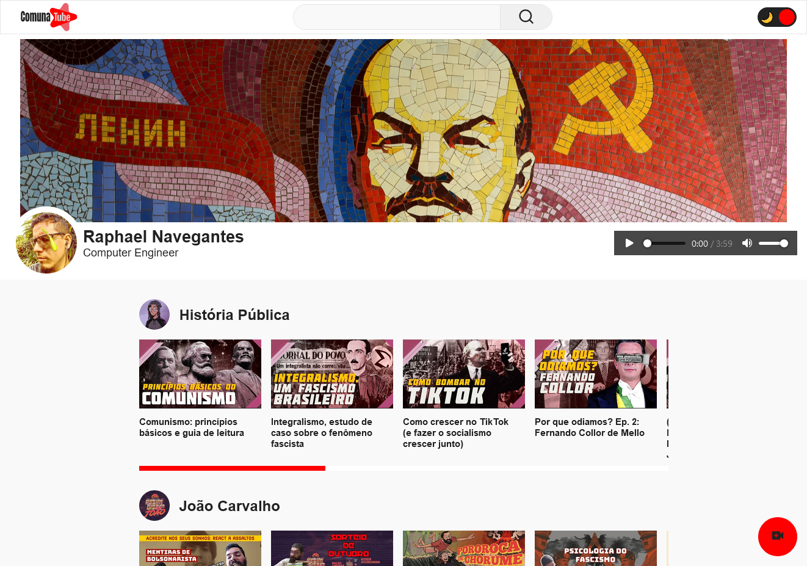
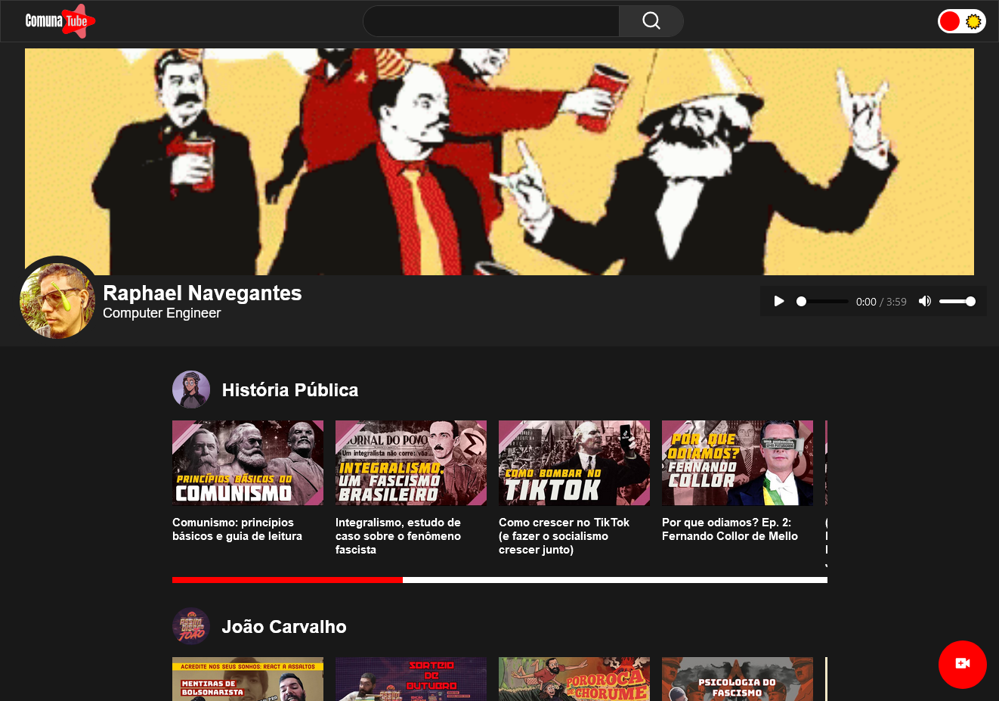
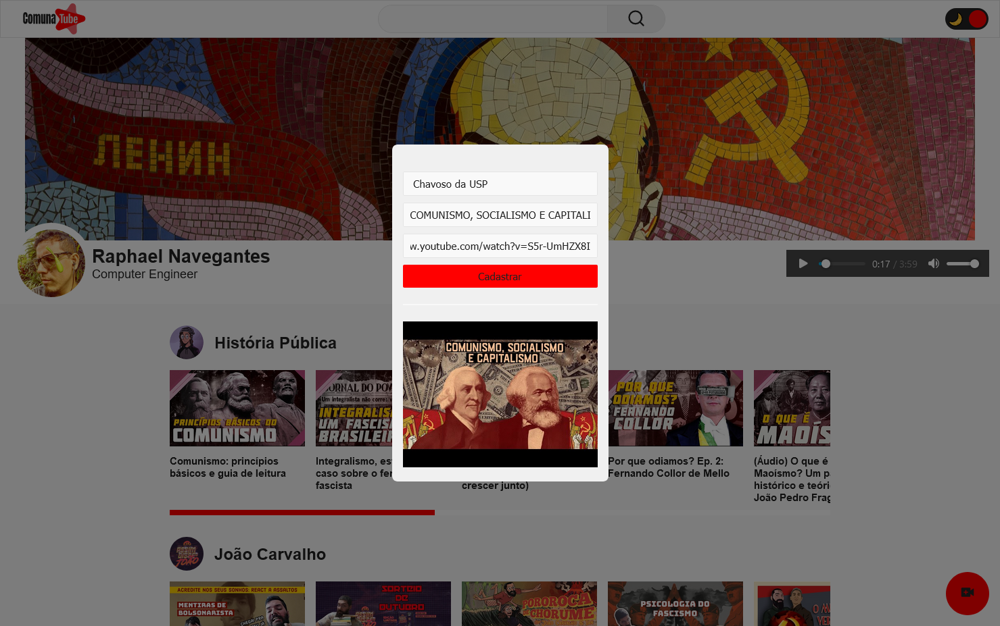
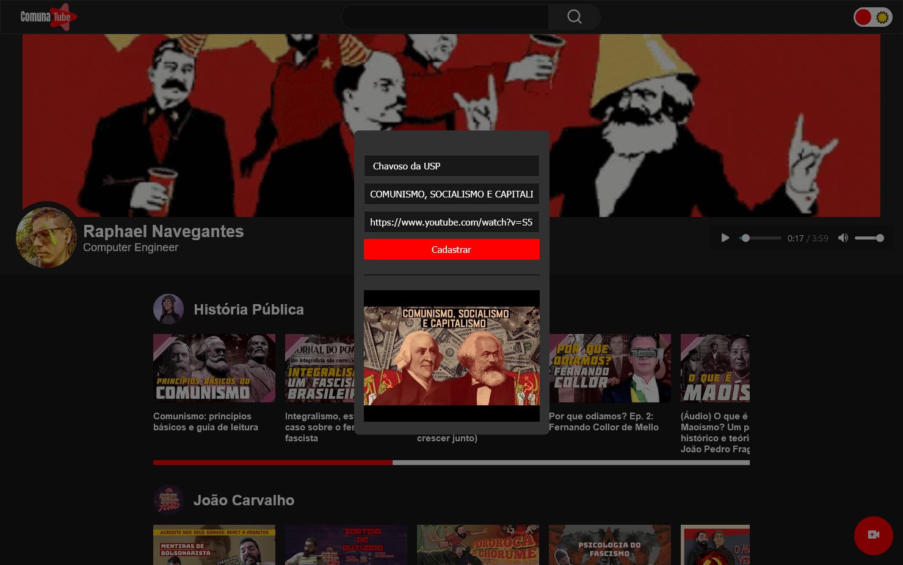

<div align="center" id="top"> 
  

  &#xa0;

  <!-- <a href="https://comunatube.netlify.com">Demo</a> -->
</div>

<!-- <h1 align="center">Comunatube</h1> -->

<p align="center">
  
  
  
  
  
  <!--  -->
  <!--  -->
</p>

<!-- Status -->

<!-- <h4 align="center"> 
	🚧  Comunatube 🚀 Em construção...  🚧
</h4> 

<hr> -->

<p align="center">
  <a href="#dart-sobre">Sobre</a> &#xa0; | &#xa0; 
  <a href="#sparkles-funcionalidades">Funcionalidades</a> &#xa0; | &#xa0;
  <a href="#rocket-tecnologias">Tecnologias</a> &#xa0; | &#xa0;
  <a href="#white_check_mark-pré-requisitos">Pré requisitos</a> &#xa0; | &#xa0;
  <a href="#checkered_flag-começando">Começando</a> &#xa0; | &#xa0;
  <a href="#memo-licença">Licença</a> &#xa0; | &#xa0;
  <a href="https://github.com/navegantes" target="_blank">Autor</a>
</p>

<div align="center">
  <div align="center">
    
    
  </div>
  <div align="center">
    
    
  </div>
  <!-- 
  
  
   -->
</div>

<br>

## 🎯 Sobre ##

Projeto desenvolvido durante a Imersão-React da [**Alura**](https://www.alura.com.br).
A ideia do sistema é criar playlists de vídeos do Youtube.

<!-- ## ✨ Funcionalidades ##

:heavy_check_mark: Funcionalidade 1;\
:heavy_check_mark: Funcionalidade 2;\
:heavy_check_mark: Funcionalidade 3; -->

## 🚀 Tecnologias ##

As seguintes ferramentas foram usadas na construção do projeto:

- [React](https://pt-br.reactjs.org/)
- [Styled Components](https://styled-components.com/)
- [React Hot Toast](https://react-hot-toast.com/)
- [Supabase](https://supabase.com/)

## ✅ Pré requisitos ##

Antes de começar :checkered_flag:, você precisa ter o [Git](https://git-scm.com) e o [Node](https://nodejs.org/en/) instalados em sua maquina.

## 🏁 Começando ##

```bash
# Clone este repositório
$ git clone https://github.com/navegantes/comunatube

# Entre na pasta
$ cd comunatube

# Instale as dependências
$ npm i

# Para iniciar o projeto
$ npm run dev

# O app vai inicializar em <http://localhost:3000>
```

<!-- ## :memo: Licença ##

Este projeto está sob licença MIT. Veja o arquivo [LICENSE](LICENSE.md) para mais detalhes. -->


Feito com :heart: por <a href="https://github.com/navegantes" target="_blank">Raphael Navegantes</a>

&#xa0;

<a href="#top">Voltar para o topo</a>
